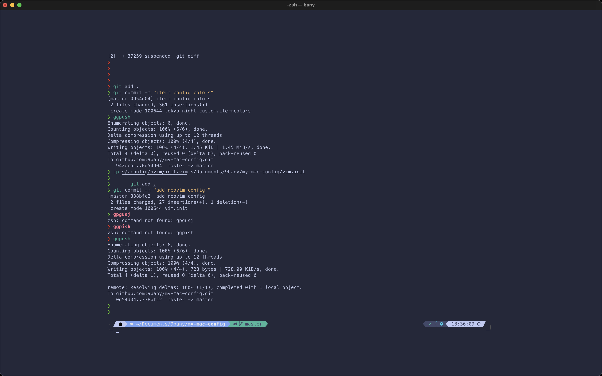

# my-mac-config
my macOS configuration

## Iterm2 theme config

- [item colors](./tokyo-night-custom.itermcolors)

- Preview

## Neovim config
- [Init file](./vim.init)

## ZSH plugins
- [thefuck](https://github.com/nvbn/thefuck)
- [fzf](https://github.com/junegunn/fzf)
- [powerlevel10k](https://github.com/romkatv/powerlevel10k)
- [zsh-autosuggestions](https://github.com/zsh-users/zsh-autosuggestions)
- [diff-so-fancy](https://github.com/so-fancy/diff-so-fancy)
- [autojump](https://github.com/wting/autojump) 
